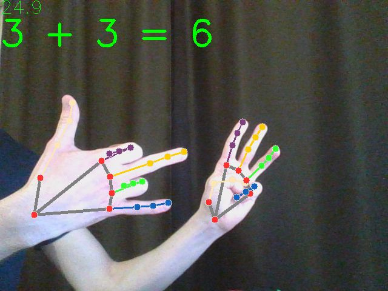

# Finger counter
Test **openCV** ( https://opencv.org ) and **mediapipe** ( https://pypi.org/project/mediapipe/ )

## Features
- Calc sum of fingers both hands

## Installation
- Install libraries `pip install -r requirements.txt`
- Run the program `python main.py`

## Result
